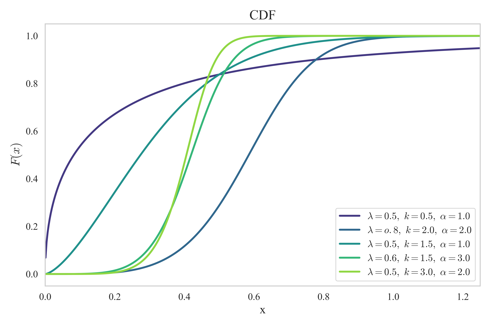
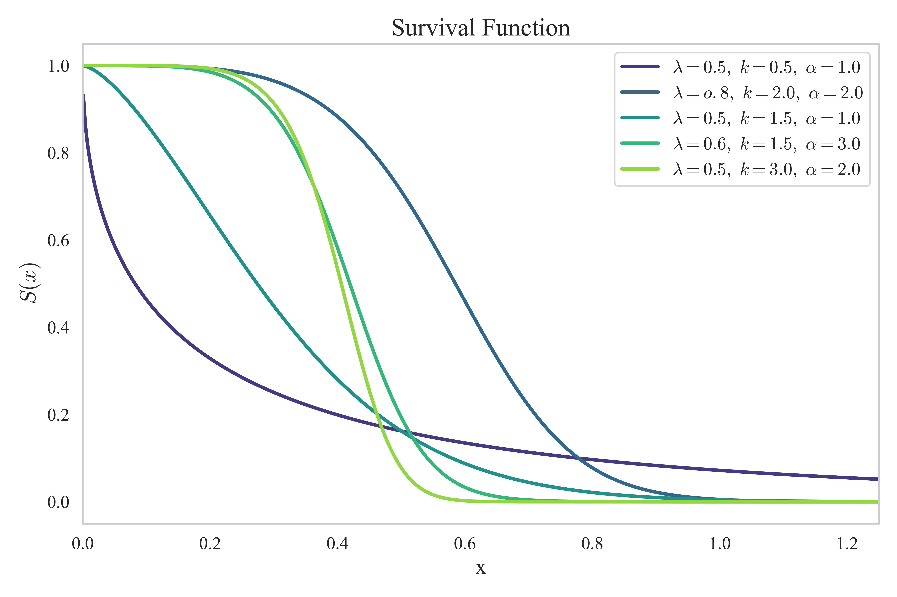
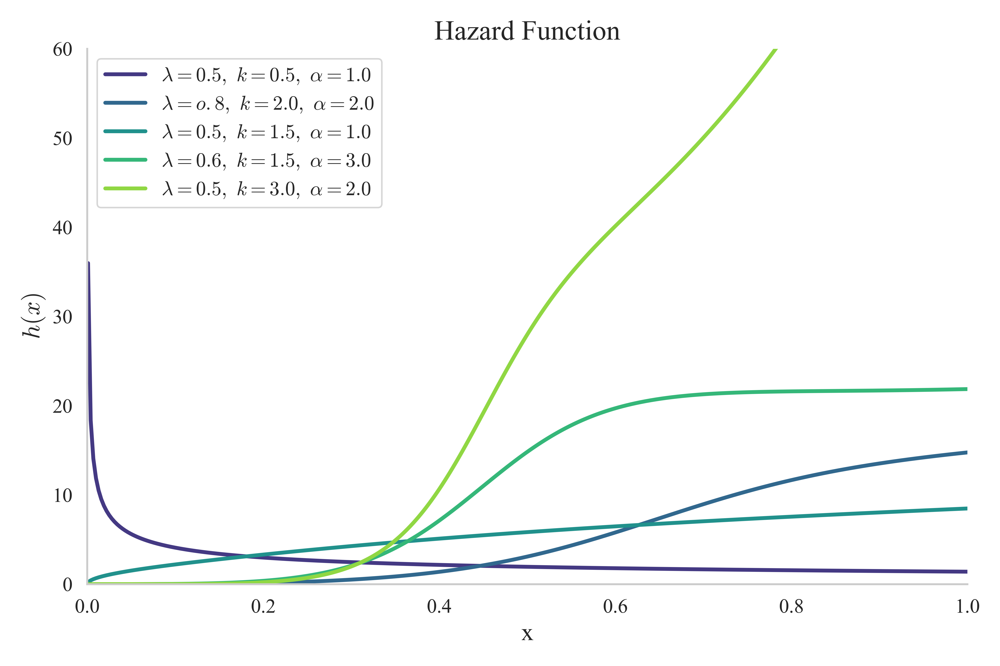

# 📘 Sine–Type II Half-Logistic Weibull Distribution (STIIHLW)

##  Overview

This repository presents a **research-grade implementation** of the **Sine–Type II Half-Logistic Weibull (STIIHLW) distribution**, a flexible probability distribution constructed through a layered transformation of the classical Weibull model.

The project integrates **statistical theory**, **interactive visualization**, and **Streamlit deployment**, enabling users to explore distributional behavior in real time through an intuitive web interface.

The application supports visualization of:

- Probability Density Function (PDF)
- Cumulative Distribution Function (CDF)
- Survival Function
- Hazard Rate Function

##  Live Application

🔗 **Streamlit App:** *(Add your Streamlit Community Cloud link here)*

The application is fully responsive and can be accessed on both desktop and mobile devices.

##  Theoretical Background

The **Sine–Type II Half-Logistic Weibull (STIIHLW)** distribution is constructed through a three-stage transformation process:

### 1️⃣ Base Distribution – Weibull  
The Weibull distribution serves as the foundational model due to its flexibility and wide applicability in reliability analysis, survival modeling, and lifetime data analysis.

### 2️⃣ Type II Half-Logistic Generator  
A Type II Half-Logistic transformation is applied to the Weibull cumulative distribution function (CDF). This step enhances skewness control and tail behavior while preserving the support of the base distribution.

### 3️⃣ Sine Generator  
A sine transformation is then applied to the transformed CDF. This step introduces additional curvature and flexibility, allowing for:

- Non-monotonic hazard functions  
- Multi-modal behavior  
- Improved adaptability to complex real-world data  

##  Implemented Functions

The following statistical functions are implemented and visualized interactively:

- **Probability Density Function (PDF)**
- **Cumulative Distribution Function (CDF)**
- **Survival Function**
- **Hazard Rate Function**

##  Visualization of Functions under different sets of Parameters

All plots shown below are generated directly from the implemented STIIHLW model.

###  Probability Density Function (PDF)

###  Cumulative Distribution Function (CDF)

###  Survival Function

###  Hazard Function

##  Key Features

- Interactive Streamlit interface  
- Real-time parameter adjustment  
- Comparative analysis with the base Weibull distribution  
- Clean and interpretable mathematical structure  
- Mobile-friendly deployment via Streamlit Community Cloud  

## Technology Stack

- Python  
- Streamlit  
- NumPy  
- SciPy  
- Matplotlib / Plotly  
- Git and GitHub

##Live Application

https://sine-type-ii-half-logistic-weibull-distribution-trymoremhlang.streamlit.app/

## 👤 Author

**Developed by:** Trymore Mhlanga  

This work represents an original statistical modeling and visualization framework designed for research and academic exploration.

## Notes

- Ensure all image files are located in the `DeriveDistributions/` directory.
- GitHub automatically renders images when the paths are correct.
- The application is optimized for deployment via Streamlit Community Cloud.

